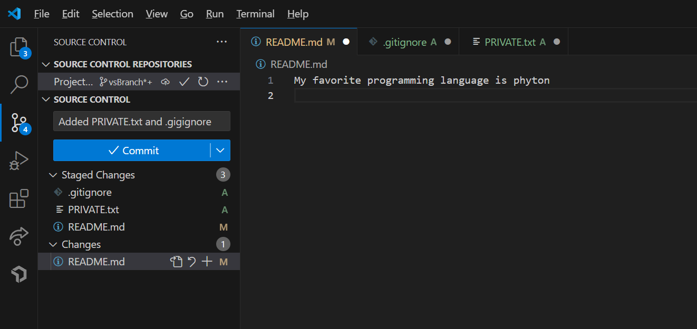

# About me
I'm a third year Math-CS student at UCSD, I have been taking coding courses in the past three years, I have used
- **phyton** 
- **java**
-  **C++** 
  
  as coding languages. 
  
[You can know about my favorite coding language in this linke](favoritecode.md)
## Past
I was born in *China*, and immigrated to *United States* when I was 8, and I lived in San Francisco for most part of the time.
> I also lived in Texas for 6 months which I did not like
## Hobby
I play a variety of sports such as 
1. basketball 
2. badminton 
3. pingpong
   
I also enjoy playing video games and reading novels.

I had a problem with committing in VScode, so I just used `git commit` to commit my work.

What I have done so far with this lab
- [x] Create repository
- [x] Made VScode Branch
- [ ] edit index.md

[I used this page as a reference on writing this page](https://docs.github.com/en/get-started/writing-on-github/getting-started-with-writing-and-formatting-on-github/basic-writing-and-formatting-syntax#links)

Here is a screenshot of my commits

[Move to top](#about-me)